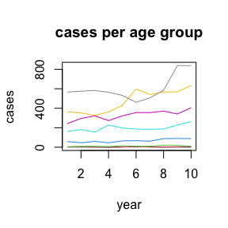
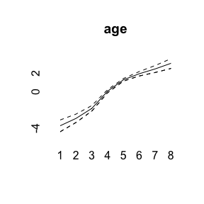
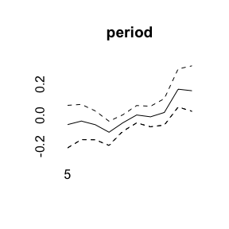
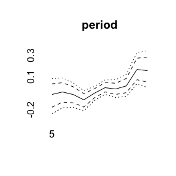
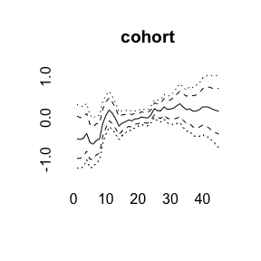
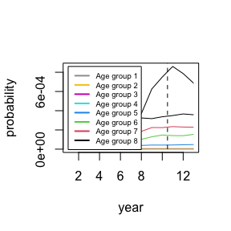

# Short Introduction to BAMP

## Data example

BAMP includes a data example.

``` r

data(apc)
plot(cases[,1],type="l",ylim=range(cases), ylab="cases", xlab="year", main="cases per age group")
for (i in 2:8)lines(cases[,i], col=i)
```



For simulating APC data, see *vignette(“simulation”, package=“bamp”)*.

## APC model with random walk first order prior

``` r

model1 <- bamp(cases, population, age="rw1", period="rw1", cohort="rw1",
              periods_per_agegroup = 5)
```

bamp() automatically performs a check for MCMC convergence using Gelman
and Rubin’s convergence diagnostic. We can manually check the
convergence again:

``` r

checkConvergence(model1)
```

    ## [1] TRUE

Now we have a look at the model results. This includes estimates of
smoothing parameters and deviance and DIC:

``` r

print(model1)
```

    ## 
    ##  Model:
    ## age (rw1)  - period (rw1)  - cohort (rw1) model
    ## Deviance:     231.56
    ## pD:            37.10
    ## DIC:          268.65
    ## 
    ## 
    ##  Hyper parameters:                 5%           50%          95%         
    ## age                              0.347        0.913        1.898
    ## period                          70.468      202.216      642.573
    ## cohort                          34.539       58.835       96.003
    ## 
    ## 
    ## Markov Chains convergence checked succesfully using Gelman's R (potential scale reduction factor).

We can plot the main APC effects using point-wise quantiles:

``` r

plot(model1)
```



More quantiles are possible:

``` r

plot(model1, quantiles = c(0.025,0.1,0.5,0.9,0.975))
```



For other models see *vignette(“modeling”,package=“bamp”)*.

## Prediction

Using the prior assumption of a random walk for the period and cohort
effect, one can predict cases for upcoming years.

``` r

pred <- predict_apc(object=model1, periods=3)
```

``` r

m<-max(pred$pr[2,,])
plot(pred$pr[2,,8],type="l", ylab="probability", xlab="year", ylim=c(0,m))
for (i in 7:1)
  lines(pred$pr[2,,i],col=8-i)
legend(1,m,col=8:1,legend=paste("Age group",1:8),lwd=2,cex=0.6)
lines(c(10.5,10.5),c(0,1),lty=2)
```



More details see *vignette(“prediction”,package=“bamp”)*.
