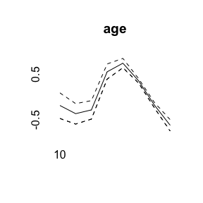
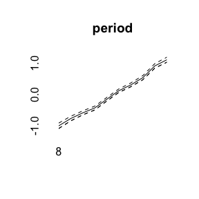
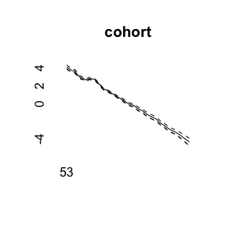
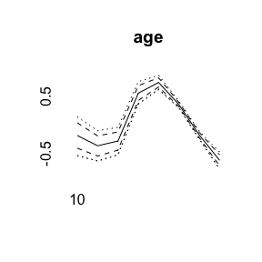
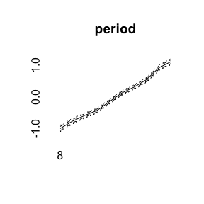
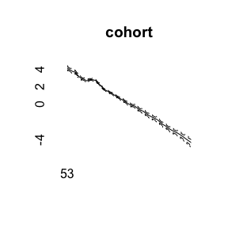
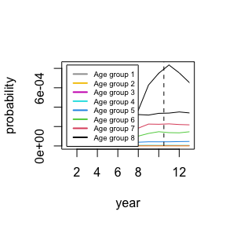

# Short Introduction to BAMP

## Introduction

Age-period-cohort (APC) models decompose incidence or mortality rates
into three smooth components: an **age** effect (how risk varies across
age groups), a **period** effect (how risk varies over calendar time)
and a **cohort** effect (how risk varies across birth cohorts). BAMP
fits such models in a Bayesian framework via MCMC and provides tools to
check convergence, inspect the fitted effects, and predict future cases.

## Data example

BAMP includes a data example: `cases` and `population`, matrices of
observed case counts and population at risk, cross-classified by
calendar year (rows) and age group (columns).

[`data`](https://rdrr.io/r/utils/data.html)`(``apc``)`` `[`plot`](https://rdrr.io/r/graphics/plot.default.html)`(``cases``[``,``1``]``,type``=``"l"``,ylim``=`[`range`](https://rdrr.io/r/base/range.html)`(``cases``)``, ylab``=``"cases"``, xlab``=``"year"``, main``=``"cases per age group"``)`` ``for`` ``(``i`` ``in`` ``2``:``8``)`[`lines`](https://rdrr.io/r/graphics/lines.html)`(``cases``[``,``i``]``, col``=``i``)`

For simulating your own APC data, see *vignette(“simulation”,
package=“bamp”)*.

## APC model with random-walk first-order priors

We fit a model with a first-order random walk (`"rw1"`) prior on each of
the age, period and cohort effects – a common default that assumes each
effect changes smoothly, without a systematic trend, between
neighbouring levels. `periods_per_agegroup` tells
[`bamp()`](https://volkerschmid.github.io/bamp/reference/bamp.md) how
many calendar years each age group spans, which is needed to map age and
period onto the cohort dimension.

`model1`` ``<-`` `[`bamp`](https://volkerschmid.github.io/bamp/reference/bamp.md)`(``cases``, ``population``, age``=``"rw1"``, period``=``"rw1"``, cohort``=``"rw1"``,`` `` periods_per_agegroup ``=`` ``5``)`

[`bamp()`](https://volkerschmid.github.io/bamp/reference/bamp.md)
automatically checks MCMC convergence using the Gelman-Rubin diagnostic
and warns if the chains have not converged. We can also run this check
manually:

[`checkConvergence`](https://volkerschmid.github.io/bamp/reference/checkConvergence.md)`(``model1``)`

    ## [1] TRUE

[`print()`](https://volkerschmid.github.io/bamp/reference/print.apc.md)
summarises the fitted model: posterior estimates of the smoothing
(precision) parameters, and the deviance and DIC, which are useful for
comparing models (see *vignette(“modeling”, package=“bamp”)* for model
selection):

[`print`](https://volkerschmid.github.io/bamp/reference/print.apc.md)`(``model1``)`

    ## 
    ##  Model:
    ## age (rw1)  - period (rw1)  - cohort (rw1) model
    ## 
    ##  Intercept:            5%           50%          95%         
    ## intercept                   -10.511      -10.446      -10.387
    ## 
    ## Deviance:     230.12
    ## pD:            36.60
    ## DIC:          266.72
    ## 
    ## 
    ##  Hyper parameters:                 5%           50%          95%         
    ## age                              0.436        1.108        2.295
    ## period                          48.842      128.964      320.787
    ## cohort                          35.190       61.080      103.190
    ## 
    ## 
    ## Markov Chains convergence checked succesfully using Gelman's R (potential scale reduction factor).

The fitted age, period and cohort effects can be plotted with point-wise
posterior quantiles:

[`plot`](https://rdrr.io/r/graphics/plot.default.html)`(``model1``)`

By default the plot shows the median and a 90% interval; other quantiles
can be requested explicitly:

[`plot`](https://rdrr.io/r/graphics/plot.default.html)`(``model1``, quantiles ``=`` `[`c`](https://rdrr.io/r/base/c.html)`(``0.025``,``0.1``,``0.5``,``0.9``,``0.975``)``)`

For other prior choices (e.g. second-order random walks, heterogeneity,
covariates), see *vignette(“modeling”, package=“bamp”)*.

## Prediction

Because the period and cohort effects are modelled as random walks,
their most likely continuation is a flat extrapolation with growing
uncertainty – which lets us predict cases for upcoming years:

`pred`` ``<-`` `[`predict_apc`](https://volkerschmid.github.io/bamp/reference/predict_apc.md)`(``object``=``model1``, periods``=``3``)`

The plot below shows the predicted probability of a case per age group;
the dashed vertical line marks the start of the 3-year forecast:

`m``<-`[`max`](https://rdrr.io/r/base/Extremes.html)`(``pred``$``pr``[``2``,,``]``)`` `[`plot`](https://rdrr.io/r/graphics/plot.default.html)`(``pred``$``pr``[``2``,,``8``]``,type``=``"l"``, ylab``=``"probability"``, xlab``=``"year"``, ylim``=`[`c`](https://rdrr.io/r/base/c.html)`(``0``,``m``)``)`` ``for`` ``(``i`` ``in`` ``7``:``1``)`` `` `[`lines`](https://rdrr.io/r/graphics/lines.html)`(``pred``$``pr``[``2``,,``i``]``,col``=``8``-``i``)`` `[`legend`](https://rdrr.io/r/graphics/legend.html)`(``1``,``m``,col``=``8``:``1``,legend``=`[`paste`](https://rdrr.io/r/base/paste.html)`(``"Age group"``,``1``:``8``)``,lwd``=``2``,cex``=``0.6``)`` `[`lines`](https://rdrr.io/r/graphics/lines.html)`(`[`c`](https://rdrr.io/r/base/c.html)`(``10.5``,``10.5``)``,`[`c`](https://rdrr.io/r/base/c.html)`(``0``,``1``)``,lty``=``2``)`

For more details, see *vignette(“prediction”, package=“bamp”)*.
