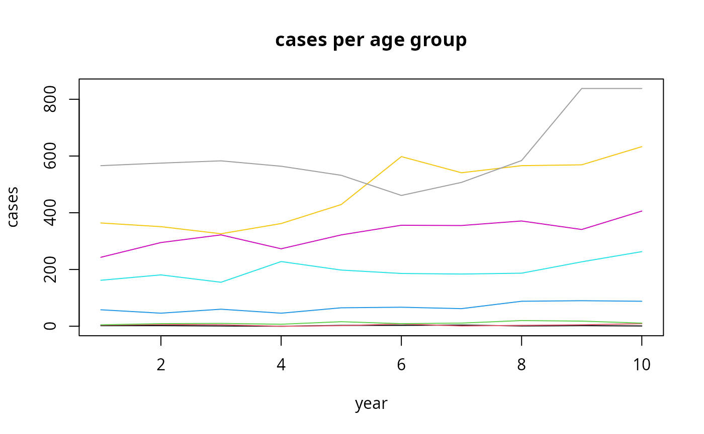

# Bayesian Age-Period-Cohort Prediction

## Prediction

Because period and cohort effects are modelled as random walks, they can
be extrapolated as a continuation of these trends, which lets
[`predict_apc()`](https://volkerschmid.github.io/bamp/reference/predict_apc.md)
forecast cases for years beyond the observed data. For a first
introduction to
[`bamp()`](https://volkerschmid.github.io/bamp/reference/bamp.md), see
*vignette(“bamp”, package=“bamp”)*; for other model specifications, see
*vignette(“modeling”, package=“bamp”)*.

We use the bundled data example, which covers ten years:

[`data`](https://rdrr.io/r/utils/data.html)`(``apc``)`` `[`plot`](https://rdrr.io/r/graphics/plot.default.html)`(``cases``[``,``1``]``,type``=``"l"``,ylim``=`[`range`](https://rdrr.io/r/base/range.html)`(``cases``)``, ylab``=``"cases"``, xlab``=``"year"``, main``=``"cases per age group"``)`` ``for`` ``(``i`` ``in`` ``2``:``8``)`[`lines`](https://rdrr.io/r/graphics/lines.html)`(``cases``[``,``i``]``, col``=``i``)`

To see how well the forecast holds up against real data, we fit the
model on only the first nine years and predict the tenth, so it can be
compared to the cases actually observed that year.

`model0`` ``<-`` `[`bamp`](https://volkerschmid.github.io/bamp/reference/bamp.md)`(``cases``[``-``10``,``]``, ``population``[``-``10``,``]``, age``=``"rw1"``, period``=``"rw1"``, cohort``=``"rw1"``,`` `` periods_per_agegroup ``=`` ``5``)`

[`predict_apc()`](https://volkerschmid.github.io/bamp/reference/predict_apc.md)
extends the fitted model by the given number of periods. With
`update = TRUE` the forecast is merged back into `model0` (as
`model0$predicted`) instead of being returned as a separate object:

`model0``<-`[`predict_apc`](https://volkerschmid.github.io/bamp/reference/predict_apc.md)`(``object``=``model0``, periods``=``1``, population``=``population``, update ``=`` ``TRUE``)`

The forecast for year 10 (dashed lines: 90% credible interval; solid
line: median) lines up well with the true total cases (points), which
were held out of the fit:

[`ts.plot`](https://rdrr.io/r/stats/ts.plot.html)`(`[`t`](https://rdrr.io/r/base/t.html)`(``model0``$``predicted``$``cases_period``)``, lty``=`[`c`](https://rdrr.io/r/base/c.html)`(``2``,``1``,``2``)``)`` `[`points`](https://rdrr.io/r/graphics/points.html)`(`[`apply`](https://rdrr.io/r/base/apply.html)`(``cases``,``1``,``sum``)``, pch``=``19``)`

The same credible intervals extend the period and cohort effects
themselves into year 10:

[`ts.plot`](https://rdrr.io/r/stats/ts.plot.html)`(`[`t`](https://rdrr.io/r/base/t.html)`(``model0``$``predicted``$``period``)``, lty``=`[`c`](https://rdrr.io/r/base/c.html)`(``2``,``1``,``2``)``)`

[`ts.plot`](https://rdrr.io/r/stats/ts.plot.html)`(`[`t`](https://rdrr.io/r/base/t.html)`(``model0``$``predicted``$``cohort``)``, lty``=`[`c`](https://rdrr.io/r/base/c.html)`(``2``,``1``,``2``)``)`

