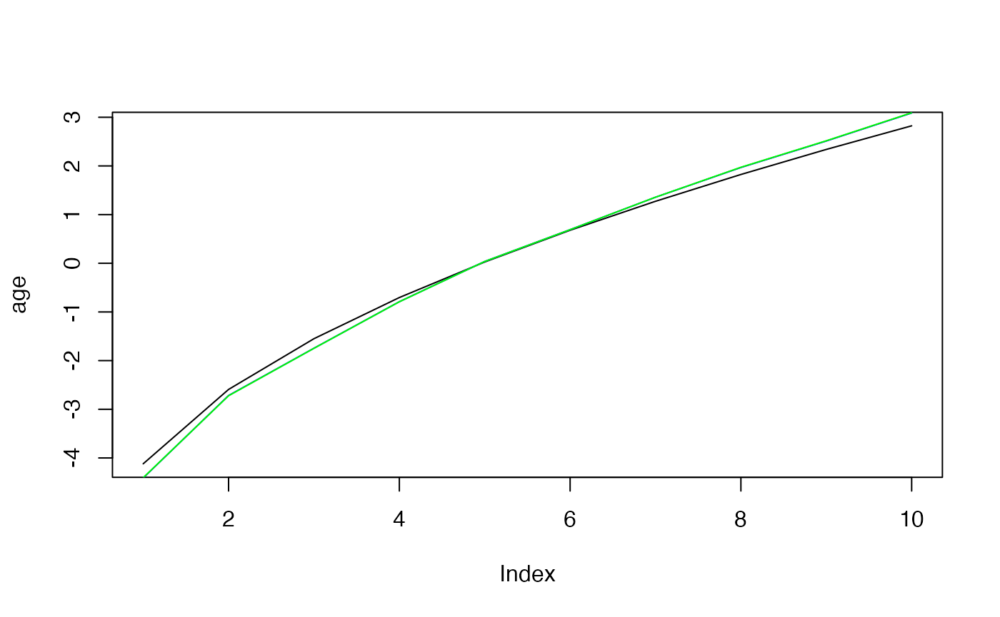
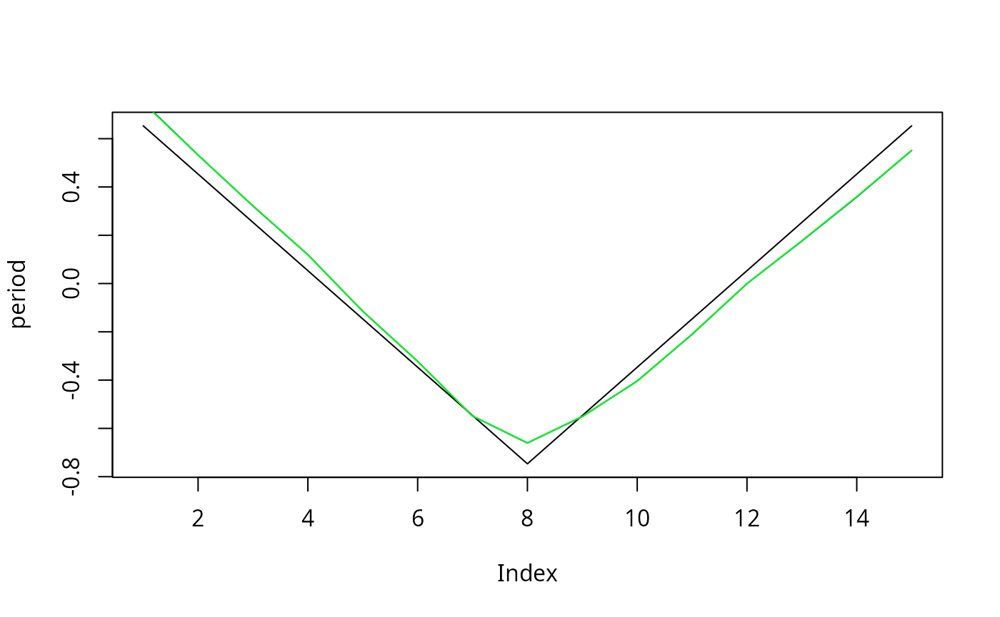
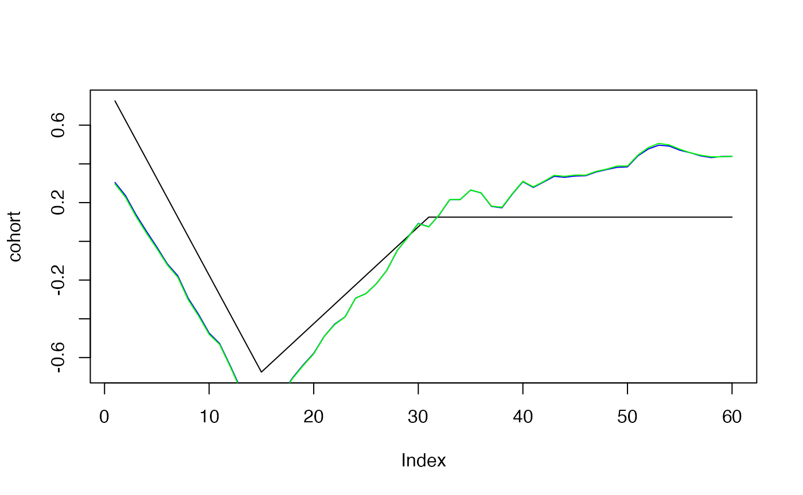

# Simulating Age-Period-Cohort Data

``` r

age=2*sqrt(seq(1,20,length=10))
age<- age-mean(age)
plot(age, type="l")
```


``` r

period=15:1
period[8:15]<-8:15
period<-period/5
period<-period-mean(period)
plot(period, type="l")
```


``` r

periods_per_agegroup=5
number_of_cohorts <- periods_per_agegroup*(10-1)+15
cohort<-rep(0,60)
cohort[1:15]<-(14:0)
cohort[16:30]<- (1:15)/2
cohort[31:60]<- 8
cohort<-cohort/10
cohort<-cohort-mean(cohort)
plot(cohort, type="l")
```


``` r

simdata<-apcSimulate(-10, age, period, cohort, periods_per_agegroup, 1e6)
print(simdata$cases)
```

    ##       [,1] [,2] [,3] [,4] [,5] [,6] [,7] [,8] [,9] [,10]
    ##  [1,]    0   10   22   52   85  114  172  413 1122  2991
    ##  [2,]    4    5   19   46   62   98  140  314  840  2246
    ##  [3,]    1    5   15   36   63   94  132  211  605  1646
    ##  [4,]    0    4    9   36   52   85  114  158  458  1232
    ##  [5,]    1    2    8   22   57   61   76  118  353   900
    ##  [6,]    1    0    7   22   25   56   90  122  264   653
    ##  [7,]    1    4    7   12   38   50   74   94  157   507
    ##  [8,]    0    0    8    7   40   51   61   81  147   393
    ##  [9,]    0    4   12   18   40   57   72  116  132   406
    ## [10,]    1    2    7   21   40   81  110  142  158   399
    ## [11,]    0    6   12   16   57   83  116  174  200   505
    ## [12,]    0    7    9   31   52   98  163  228  262   564
    ## [13,]    0   10   16   40   65  143  213  267  350   580
    ## [14,]    1   10   19   37   92  152  273  376  428   665
    ## [15,]    2    8   15   56  129  228  341  435  567   779

``` r

simmod <- bamp(cases = simdata$cases, population = simdata$population, age = "rw1", 
period = "rw1", cohort = "rw1", periods_per_agegroup =periods_per_agegroup)
```

``` r

print(simmod)
```

    ## 
    ##  Model:
    ## age (rw1)  - period (rw1)  - cohort (rw1) model
    ## Deviance:     161.88
    ## pD:            48.88
    ## DIC:          210.76
    ## 
    ## 
    ##  Hyper parameters:                 5%           50%          95%         
    ## age                              0.517        1.242        2.503
    ## period                          14.810       28.145       48.407
    ## cohort                          82.838      129.092      196.477
    ## 
    ## 
    ## Markov Chains convergence checked succesfully using Gelman's R (potential scale reduction factor).

``` r

checkConvergence(simmod)
```

    ## [1] TRUE

``` r

plot(simmod)
```


``` r

effects<-effects(simmod)
effects2<-effects(simmod, mean=TRUE)
#par(mfrow=c(3,1))
plot(age, type="l")
lines(effects$age, col="blue")
lines(effects2$age, col="green")
```



``` r

plot(period, type="l")
lines(effects$period, col="blue")
lines(effects2$period, col="green")
```



``` r

plot(cohort, type="l")
lines(effects$cohort, col="blue")
lines(effects2$cohort, col="green")
```



``` r

prediction<-predict_apc(simmod, periods=5, population=array(1e6,c(20,10)))
```

``` r

plot(prediction$cases_period[2,], ylim=range(prediction$cases_period),ylab="",pch=19)
points(prediction$cases_period[1,],pch="–",cex=2)
points(prediction$cases_period[3,],pch="–",cex=2)
for (i in 1:20)lines(rep(i,3),prediction$cases_period[,i])
```


``` r

plot(prediction$period[2,])
```


``` r

cov_p<-rnorm(15,period,.1)
```

``` r

simmod2 <- bamp(cases = simdata$cases, population = simdata$population, age = "rw1", 
period = "rw1", cohort = "rw1", periods_per_agegroup = periods_per_agegroup,
period_covariate = cov_p)
```

    ## Warning: MCMC chains did not converge!

``` r

print(simmod2)
```

    ## 
    ## WARNING! Markov Chains have apparently not converged! DO NOT TRUST THIS MODEL!
    ## 
    ##  Model:
    ## age (rw1)  - period (rw1)  - cohort (rw1) model
    ## Deviance:     161.78
    ## pD:            48.92
    ## DIC:          210.70
    ## 
    ## 
    ##  Hyper parameters:                 5%           50%          95%         
    ## age                              0.541        1.229        2.520
    ## period                          14.605       28.150       48.603
    ## cohort                          80.226      129.314      197.128

``` r

checkConvergence(simmod2)
```

    ## Warning: MCMC chains did not converge!

    ## [1] FALSE

``` r

plot(simmod2)
```


