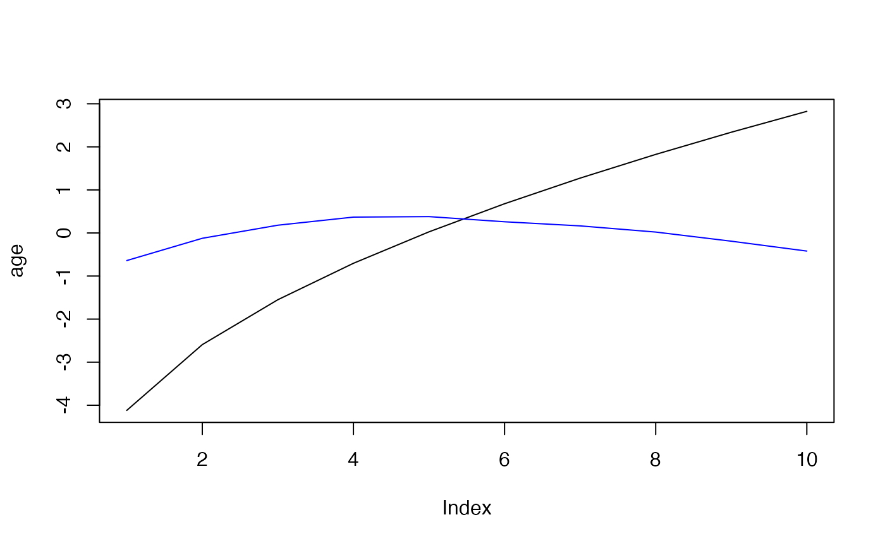
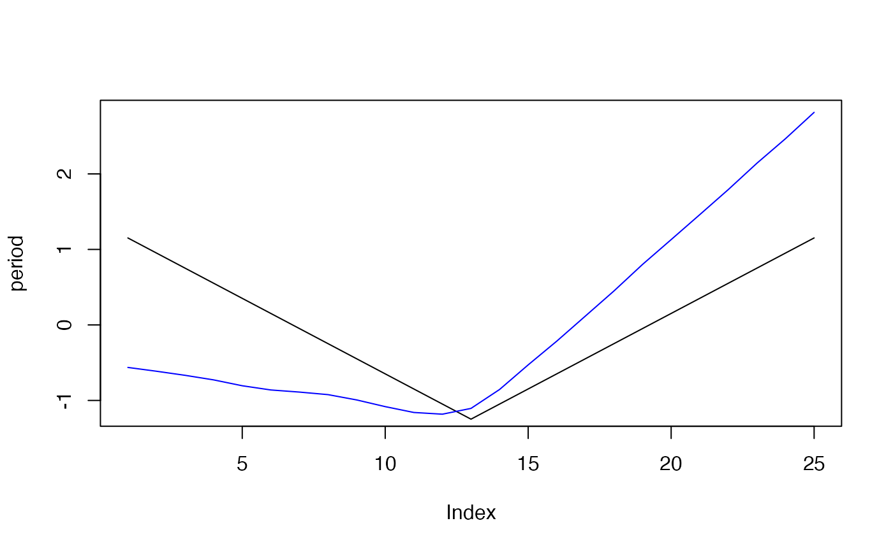
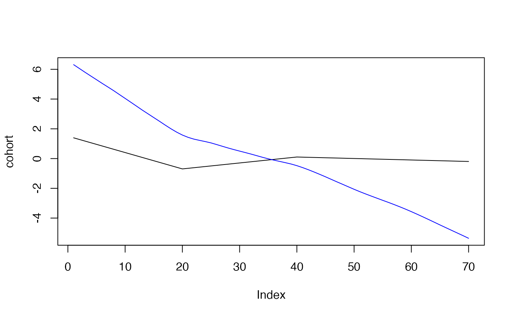

# Simulating Age-Period-Cohort Data

This vignette simulates age-period-cohort data from known,
hand-specified age, period and cohort effects, fits
[`bamp()`](https://volkerschmid.github.io/bamp/reference/bamp.md) to the
simulated cases, and checks that the fitted effects recover the true
ones – a good way to sanity check the method, or to plan how much data a
study design would need. For a first introduction to
[`bamp()`](https://volkerschmid.github.io/bamp/reference/bamp.md), see
*vignette(“bamp”, package=“bamp”)*; for other model specifications, see
*vignette(“modeling”, package=“bamp”)*.

## Specifying the true effects

We first fix the three true effects on the log-odds scale; each is
centred (mean zero) since only their shape, not their level, is
identified (see *vignette(“modeling”, package=“bamp”)*). The age effect
is an increasing, concave curve:

`age``=``2``*`[`sqrt`](https://rdrr.io/r/base/MathFun.html)`(`[`seq`](https://rdrr.io/r/base/seq.html)`(``1``,``20``,length``=``10``)``)`` ``age``<-`` ``age``-`[`mean`](https://rdrr.io/r/base/mean.html)`(``age``)`` `[`plot`](https://rdrr.io/r/graphics/plot.default.html)`(``age``, type``=``"l"``)`

The period effect is V-shaped: it falls for the first half of the
observed periods, then rises again over the second half:

`period``=``25``:``1`` ``period``[``13``:``25``]``<-``13``:``25`` ``period``<-``period``/``5`` ``period``<-``period``-`[`mean`](https://rdrr.io/r/base/mean.html)`(``period``)`` `[`plot`](https://rdrr.io/r/graphics/plot.default.html)`(``period``, type``=``"l"``)`

The cohort effect falls for the earliest cohorts, rises through the
middle ones, then slightly falls for the most recent cohorts. With
`periods_per_agegroup = 5` and 10 age groups spanning 25 periods, there
are `periods_per_agegroup * (10 - 1) + 25 = 70` cohorts:

`periods_per_agegroup``=``5`` ``number_of_cohorts`` ``<-`` ``periods_per_agegroup``*``(``10``-``1``)``+``25`` ``cohort``<-`[`rep`](https://rdrr.io/r/base/rep.html)`(``0``,``70``)`` ``cohort``[``1``:``20``]``<-``(``19``:``0``)`` ``cohort``[``21``:``40``]``<-`` ``(``1``:``20``)``/``2`` ``cohort``[``41``:``70``]``<-`` ``10`` ``cohort``=``cohort``-``(``1``:``70``)``/``10`` ``cohort``<-``cohort``/``10`` ``cohort``<-``cohort``-`[`mean`](https://rdrr.io/r/base/mean.html)`(``cohort``)`` `[`plot`](https://rdrr.io/r/graphics/plot.default.html)`(``cohort``, type``=``"l"``)`

## Simulating data from the true effects

[`apcSimulate()`](https://volkerschmid.github.io/bamp/reference/apcSimulate.md)
combines an intercept (here `-10`, on the log-odds scale) with the three
true effects and a population of `1 000 000` per Lexis cell to draw
simulated case counts, returning `cases` and `population` matrices just
like the bundled `apc` data example:

`simdata``<-`[`apcSimulate`](https://volkerschmid.github.io/bamp/reference/apcSimulate.md)`(``-``10``, ``age``, ``period``, ``cohort``, ``periods_per_agegroup``, ``1e6``)`` `[`print`](https://volkerschmid.github.io/bamp/reference/print.apc.md)`(``simdata``$``cases``)`

    ##       [,1] [,2] [,3] [,4] [,5] [,6] [,7] [,8] [,9] [,10]
    ##  [1,]    0   15   30   59   99  141  406 1197 3438  9608
    ##  [2,]    5    8   27   52   96  116  285  863 2560  7111
    ##  [3,]    0    6   23   41   72  113  222  621 1944  5172
    ##  [4,]    1    7   16   45   50   99  147  495 1363  3847
    ##  [5,]    1    6   13   26   57   76  116  321  997  2770
    ##  [6,]    2    6   11   21   33   54   96  261  750  2013
    ##  [7,]    2    2    9   24   36   53   70  163  572  1569
    ##  [8,]    1    1   12   22   35   52   79  151  386  1185
    ##  [9,]    1    2    8   26   29   42   66  123  279   830
    ## [10,]    1    2    2   17   16   30   53   94  204   601
    ## [11,]    1    2    4   23   17   39   49   55  159   402
    ## [12,]    0    2    2   12   14   37   27   62  105   330
    ## [13,]    0    3    4   10   22   18   36   40   75   252
    ## [14,]    2    0    4    7   23   30   37   56   99   278
    ## [15,]    0    3    6   12   22   32   59   97  124   289
    ## [16,]    0    2    7   12   27   49   67   93  118   309
    ## [17,]    0    1    5    7   39   63   90  125  145   353
    ## [18,]    1    4    3   20   44   65   97  149  210   359
    ## [19,]    2    3   12   23   55   99  122  205  297   392
    ## [20,]    0    7    6   21   70  117  186  262  352   417
    ## [21,]    0    7   20   27   66  134  210  303  431   578
    ## [22,]    1    5   20   38   83  168  279  396  525   673
    ## [23,]    2    6   19   45  121  208  330  513  665   917
    ## [24,]    2    5   20   60  125  242  471  604  839  1112
    ## [25,]    2    7   24   58  138  313  586  775 1049  1509

## Recovering the effects with `bamp()`

We fit a second-order random-walk (RW2) model to the simulated data:

`simmod`` ``<-`` `[`bamp`](https://volkerschmid.github.io/bamp/reference/bamp.md)`(``cases ``=`` ``simdata``$``cases``, population ``=`` ``simdata``$``population``, age ``=`` ``"rw2"``,`` ``period ``=`` ``"rw2"``, cohort ``=`` ``"rw2"``, periods_per_agegroup ``=``periods_per_agegroup``)`

[`print`](https://volkerschmid.github.io/bamp/reference/print.apc.md)`(``simmod``)`

    ## 
    ##  Model:
    ## age (rw2)  - period (rw2)  - cohort (rw2) model
    ## Deviance:     252.83
    ## pD:            40.63
    ## DIC:          293.46
    ## 
    ## 
    ##  Hyper parameters:                 5%           50%          95%         
    ## age                              3.148        7.788       16.062
    ## period                         146.307      282.779      504.666
    ## cohort                         991.512     1827.299     3301.015
    ## 
    ## 
    ## Markov Chains convergence checked succesfully using Gelman's R (potential scale reduction factor).

[`par`](https://rdrr.io/r/graphics/par.html)`(``mfrow``=`[`c`](https://rdrr.io/r/base/c.html)`(``3``,``1``)``)`` `[`plot`](https://rdrr.io/r/graphics/plot.default.html)`(``simmod``)`

Since we know the true effects here (unlike with real data), we can
check directly how well
[`bamp()`](https://volkerschmid.github.io/bamp/reference/bamp.md)
recovered them: the black line is the true effect, the blue line the
fitted posterior median
([`effects()`](https://rdrr.io/r/stats/effects.html)). Because the age,
period and cohort effects are only identified up to a shared linear
trend (see *vignette(“modeling”, package=“bamp”)*), the recovered curves
show the same nonlinear (curvature) features as the truth, but are
linearly shifted relative to it.

`effects``<-`[`effects`](https://rdrr.io/r/stats/effects.html)`(``simmod``)`` `[`plot`](https://rdrr.io/r/graphics/plot.default.html)`(``age``, type``=``"l"``)`` `[`lines`](https://rdrr.io/r/graphics/lines.html)`(``effects``$``age``, col``=``"blue"``)`

[`plot`](https://rdrr.io/r/graphics/plot.default.html)`(``period``, type``=``"l"``, ylim``=`[`range`](https://rdrr.io/r/base/range.html)`(``effects``$``period``)``)`` `[`lines`](https://rdrr.io/r/graphics/lines.html)`(``effects``$``period``, col``=``"blue"``)`

[`plot`](https://rdrr.io/r/graphics/plot.default.html)`(``cohort``, type``=``"l"``, ylim``=`[`range`](https://rdrr.io/r/base/range.html)`(``effects``$``cohort``)``)`` `[`lines`](https://rdrr.io/r/graphics/lines.html)`(``effects``$``cohort``, col``=``"blue"``)`

## Prediction

As in *vignette(“prediction”, package=“bamp”)*, the fitted random walks
can be extrapolated to forecast cases for periods beyond the simulated
data – here 5 more, so the supplied `population` array covers 30 periods
(25 observed + 5 forecast) across the 10 age groups:

`prediction``<-`[`predict_apc`](https://volkerschmid.github.io/bamp/reference/predict_apc.md)`(``simmod``, periods``=``5``, population``=`[`array`](https://rdrr.io/r/base/array.html)`(``1e6``,`[`c`](https://rdrr.io/r/base/c.html)`(``30``,``10``)``)``, quantiles``=`[`c`](https://rdrr.io/r/base/c.html)`(``.1``,``.5``,``.9``)``)`

Total predicted cases per period are shown with their median (solid
points) and 80% credible interval (dashes):

[`plot`](https://rdrr.io/r/graphics/plot.default.html)`(``prediction``$``cases_period``[``2``,``]``, ylim``=`[`range`](https://rdrr.io/r/base/range.html)`(``prediction``$``cases_period``)``,ylab``=``""``,pch``=``19``)`` `[`points`](https://rdrr.io/r/graphics/points.html)`(``prediction``$``cases_period``[``1``,``]``,pch``=``"–"``,cex``=``2``)`` `[`points`](https://rdrr.io/r/graphics/points.html)`(``prediction``$``cases_period``[``3``,``]``,pch``=``"–"``,cex``=``2``)`` ``for`` ``(``i`` ``in`` ``1``:``30``)`[`lines`](https://rdrr.io/r/graphics/lines.html)`(`[`rep`](https://rdrr.io/r/base/rep.html)`(``i``,``3``)``,``prediction``$``cases_period``[``,``i``]``)`

The period effect itself extends the same way into the 5 forecast
periods:

[`plot`](https://rdrr.io/r/graphics/plot.default.html)`(``prediction``$``period``[``2``,``]``, type``=``"l"``, ylim``=`[`range`](https://rdrr.io/r/base/range.html)`(``prediction``$``period``)``)`` `[`points`](https://rdrr.io/r/graphics/points.html)`(``prediction``$``period``[``2``,``1``:``25``]``)`` ``for`` ``(``i`` ``in`` ``26``:``30``)`[`lines`](https://rdrr.io/r/graphics/lines.html)`(`[`rep`](https://rdrr.io/r/base/rep.html)`(``i``,``3``)``,``prediction``$``period``[``,``i``]``)`

## Period covariate

Finally, we refit the simulated data with a period covariate scaling the
period effect (see *vignette(“modeling”, package=“bamp”)*). A period
covariate is a positive multiplier, so it must be larger than zero.

`cov_p``<-`[`exp`](https://rdrr.io/r/base/Log.html)`(`[`rnorm`](https://rdrr.io/r/stats/Normal.html)`(``30``,``period``,``.1``)``)`

`simmod2`` ``<-`` `[`bamp`](https://volkerschmid.github.io/bamp/reference/bamp.md)`(``cases ``=`` ``simdata``$``cases``, population ``=`` ``simdata``$``population``, age ``=`` ``"rw1"``,`` ``period ``=`` ``"rw1"``, cohort ``=`` ``"rw1"``, periods_per_agegroup ``=`` ``periods_per_agegroup``,`` ``period_covariate ``=`` ``cov_p``)`

[`print`](https://volkerschmid.github.io/bamp/reference/print.apc.md)`(``simmod2``)`

    ## 
    ##  Model:
    ## age (rw1)  - period (rw1)  - cohort (rw1) model
    ## Deviance:     253.92
    ## pD:            69.51
    ## DIC:          323.43
    ## 
    ## 
    ##  Hyper parameters:                 5%           50%          95%         
    ## age                              0.677        1.527        2.951
    ## period                           1.947        3.450        5.928
    ## cohort                          77.981      116.366      167.747
    ## 
    ## 
    ## Markov Chains convergence checked succesfully using Gelman's R (potential scale reduction factor).

[`par`](https://rdrr.io/r/graphics/par.html)`(``mfrow``=`[`c`](https://rdrr.io/r/base/c.html)`(``3``,``1``)``)`` `[`plot`](https://rdrr.io/r/graphics/plot.default.html)`(``simmod2``)`

`prediction2``<-`[`predict_apc`](https://volkerschmid.github.io/bamp/reference/predict_apc.md)`(``simmod2``, periods``=``5``, population``=`[`array`](https://rdrr.io/r/base/array.html)`(``1e6``,`[`c`](https://rdrr.io/r/base/c.html)`(``30``,``10``)``)``, quantiles``=`[`c`](https://rdrr.io/r/base/c.html)`(``.1``,``.5``,``.9``)``)`

[`plot`](https://rdrr.io/r/graphics/plot.default.html)`(``prediction2``$``cases_period``[``2``,``]``, ylim``=`[`range`](https://rdrr.io/r/base/range.html)`(``prediction2``$``cases_period``)``,ylab``=``""``,pch``=``19``)`` `[`points`](https://rdrr.io/r/graphics/points.html)`(``prediction2``$``cases_period``[``1``,``]``,pch``=``"–"``,cex``=``2``)`` `[`points`](https://rdrr.io/r/graphics/points.html)`(``prediction2``$``cases_period``[``3``,``]``,pch``=``"–"``,cex``=``2``)`` ``for`` ``(``i`` ``in`` ``1``:``30``)`[`lines`](https://rdrr.io/r/graphics/lines.html)`(`[`rep`](https://rdrr.io/r/base/rep.html)`(``i``,``3``)``,``prediction2``$``cases_period``[``,``i``]``)`

